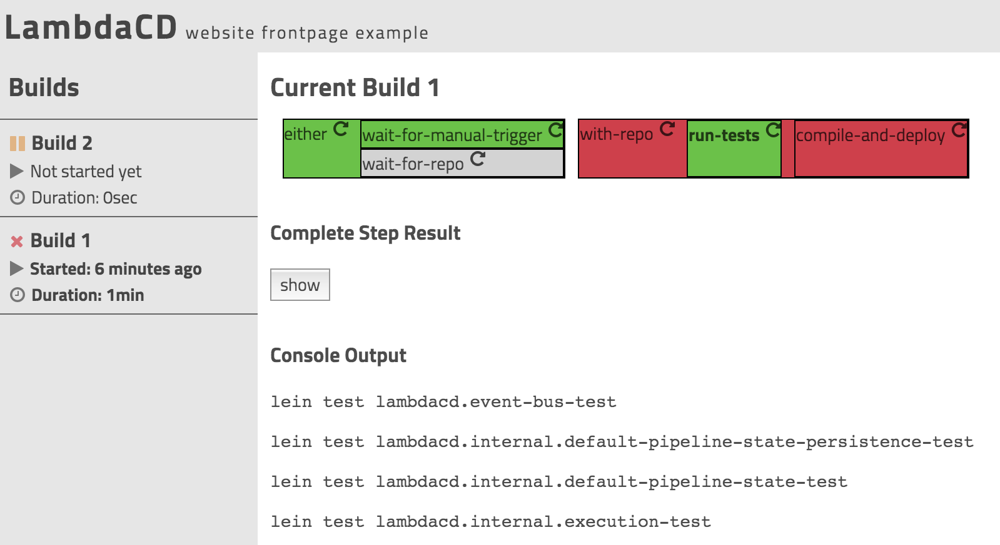

# LambdaCD


* it's a continuous delivery pipeline, in code
* it's your own custom built Jenkins/Go/TeamCity/..., in clojure


## Status

[](http://clojars.org/lambdacd)

[](https://travis-ci.org/flosell/lambdacd)

This project is still under active development so don't rely on everything working flawlessly out of the box.
Also, things might change along the way so when you upgrade, make sure you check out the [changelog](CHANGELOG.md)

However, people do use LambdaCD in their day to day work and are happy with it, so give it a try!
And if you notice something, please open bug reports, feature requests or just give feedback!

## Setup

* Make sure you have [Leiningen](http://leiningen.org) and a recent version of 
  [JDK](http://www.oracle.com/technetwork/java/javase/downloads/jdk8-downloads-2133151.html) installed
* `lein new lambdacd <NAME>` will create a new pipeline-project
* `cd <NAME>`
* `lein run` downloads all dependencies and starts the server; the UI is then served on on [http://localhost:8080](http://localhost:8080)
* your pipeline is defined in `src/<NAME>/`. Have a look around, change some steps or add some steps on your own.


## Example

```clojure
;; buildsteps
(def some-repo "git@github.com:flosell/somerepo")

(defn wait-for-repo [_ ctx]
  (git/wait-for-git ctx some-repo "master"))

(defn ^{:display-type :container} with-repo [& steps]
  (git/with-git some-repo steps))

(defn run-tests [{cwd :cwd} ctx]
  (shell/bash ctx cwd
    "lein test"))

(defn compile-and-deploy [{cwd :cwd} ctx]
  (shell/bash ctx cwd
    "./buildscripts/compile-and-deploy.sh"))

;; the pipeline
(def pipeline
  `(
     (either
       wait-for-manual-trigger
       wait-for-repo)
     (with-repo
       run-tests
       compile-and-deploy)))
```

## Screenshot



## Chat

* `#lambdacd` on the [clojurians slack](https://clojurians.slack.com/messages/lambdacd/)
* `#lambdacd` on [gitter](https://gitter.im/flosell/lambdacd)

## Resources

* [Getting Started](http://www.lambda.cd/getting-started/)
* [FAQ](doc/FAQ.md)
* [How to do ...](doc/howto.md)
* [Wiki Documentation](https://github.com/flosell/lambdacd/wiki)
* [Talk at ClojureD 2016 (Video)](https://youtu.be/XXiAS_BEDhQ)
* Detailed Tutorial: [doc/walkthrough.md](doc/walkthrough.md)
* A complete LambdaCD infrastructure in code: https://github.com/flosell/devops-101-lambdacd
* Documented Sample-Code: [example/clj/todopipeline](example/clj/todopipeline)
* Blog Post on LambdaCD at Otto including tutorial: http://dev.otto.de/2015/06/29/microservices-ci-with-lambdacd-microservices-and-continuous-integration-with-lambdacd-23/

## Related projects

* [lambdacd-git](https://github.com/flosell/lambdacd-git): Next generation of Git support for LambdaCD. Will replace the functionality in the core `lambdacd.steps.git` namespace in the future
* [lambdacd-cctray](https://github.com/flosell/lambdacd-cctray): Support for cctray.xml to integrate LambdaCD with build monitoring tools such as [nevergreen](http://nevergreen.io/) or [CCMenu](http://ccmenu.org/)
* [lambdacd-artifacts](https://github.com/flosell/lambdacd-artifacts): Makes arbitrary build-artifacts (test-results, binaries, ...) available on LambdaCD
* [lambdacd-junit](https://github.com/thilo11/lambdacd-junit): Makes JUnit test reports available in LambdaCD 
* [lambdacd-cron](https://github.com/felixb/lambdacd-cron): A cron trigger for your LambdaCD
* [lambdacd-mongodb](https://github.com/SimonMonecke/lambdacd-mongodb): Alternative persistence backend for LambdaCD, saving the pipeline state into MongoDB instead of the filesystem
* [machroput](https://github.com/otto-de/machroput): LambdaCD-aware library simplifying deployments into a Mesos Cluster running [Marathon](https://github.com/mesosphere/marathon) or [Chronos](https://github.com/mesos/chronos)

## Contribute

I'd love to hear from you! If you have a question, a bug report or feature request please reach out.

For details, refer to the [contribution guide](CONTRIBUTING.md)

## Development

LambdaCD is built in Clojure and ClojureScript with [Leiningen](http://leiningen.org) as a build-tool.
The `./go` script is your main entry-point that wraps all important development tasks.
Call it without arguments to see all the options.

### General Setup 

* Call `./go setup` to install necessary dependencies and build everything once. 

### Core Development

* Sources for the core of LambdaCD can be found in `src/clj`, tests in `test/clj`.
* Run tests with `./go test-clj`
* To run a sample-pipeline (see `example/clj`), run `./go serve`. You may have to run `./go serve-cljs` occasionally to
  generate the frontend JS code from ClojureScript.
* If you want the example pipeline to be green (which is not necessary for all development), you first need to setup a
  mock-deployment environment on your machine (two VMs where we deploy a TodoMVC client and server):
  * install [Vagrant](http://www.vagrantup.com/downloads.html)
  * have github-access set up (you need to be able to clone with ssh)
  * `./go setupTodopipelineEnv` starts up two VMs in vagrant where we deploy to and exports the ssh-config for them so that it can be used by the deployment scripts

### Frontend Development

* The frontend is written in ClojureScript using [Reagent](https://github.com/reagent-project/reagent) and [re-frame](https://github.com/Day8/re-frame)
* Frontend resources can be found in `resources/public`, ClojureScript code in `src/cljs`, tests in `test/cljs`
* Stylesheets are written in are in [Less](http://lesscss.org/) and can be found in `src/less`
* ClojureScript code needs to be compiled into JS before being useful
* In three terminals, run `./go serve` to start an example pipeline (if you want it to be green, follow the environment
  setup above), `./go serve-cljs` to start a ClojureScript REPL and automatic code-reloading using
  [Figwheel](https://github.com/bhauman/lein-figwheel) and `./go serve-css` to run the css autoprefixer watch
* Run `./go test-cljs` to run frontend-tests or `./go test-cljs-auto` to start autotest


## License

Copyright © 2014 Florian Sellmayr

Distributed under the Apache License 2.0
