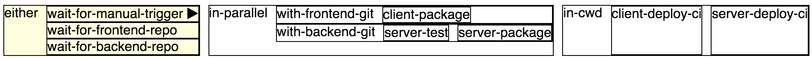

# Your first build pipeline with LambdaCD

This will guide you through a simple pipeline setup.
LambdaCD being a clojure-library, knowing a bit of clojure helps, but if you aren't a convert yet, give it a shot anyway.
If you need help, I provided some [pointers](basic-clojure.md) to help you out.

## The task

As LambdaCD is a tool to implement build-pipelines, in this walkthrough we are going to implement one.
Specifically, we are going to implement a pipeline that is pulling a [TodoMVC](http://todomvc.com/) client and backend
from GitHub, run tests, assemble publish artifacts and deploy those artifacts onto servers to run from.

The whole thing will look more or less like this:


If you want to see the end-result, look into the LambdaCD-Repository: [../example/clj/todopipeline](../example/clj/todopipeline)

## Setup

Before we start, I said we wanted to deploy apps to a server, so we probably need a server and some deployment scripts. Fortunately, LambdaCD is using the exact same example during development so there are some things ready for you to use. Basically, the setup is two vagrant boxes to deploy to and some bash scripts that handle most of the deployment.

If you aren't sure if you want to do the whole walkthrough, feel free to skip this step for now and only set up these things once you get to the actual deployment part.

So let's get started.
* Make sure you have [Vagrant](http://www.vagrantup.com/downloads.html) installed
* Make sure you have [Leiningen 2.x](http://leiningen.org/#install) installed
* Clone the [LambdaCD repo](https://github.com/flosell/lambdacd). You normally don't need to do this to create a pipeline, it just so happens that the Vagrant setup is there at the moment.
* in the cloned repo, run `./go setupTodopipelineEnv`. This will run for a while to start your two Vagrant boxes you can deploy to.
* You should now have a fully functioning setup. You can run the example pipeline using `lein run` just to make sure.


## Your first pipeline - The template

### Poking around

After all this setup, lets really get started.
First of all, we need a new project to develop our pipeline: `lein new lambdacd pipeline-tutorial` will create a new project for you,
already set up with some sensible defaults and ready to run.

So let's run it:
`cd` ito the newly created `pipeline-tutorial` directory and run `lein run`.
After a few seconds, this will start up a server listening on port 8080.
Open [http://localhost:8080](http://localhost:8080) to see the overview-page showing your pipelines current state.
Click on the first step (it's a manual trigger) to start the pipeline. Now things start to move and you see a running build.

### Pipeline Structure

But where did this all come from?

Let's find out. Open `src/pipeline_tutorial/pipeline.clj`. This is where your pipeline lives.
Specifically, `pipeline-def`. This contains a list of clojure functions that are being executed during a pipeline-run.
So in this case, it first calls the function `wait-for-manual-trigger` from the `lambdacd.manualtrigger` namespace.
This is a function LambdaCD provides to implement the trigger functionality you just saw.
After this function returns (after you clicked the trigger), the `some-step-that-does-nothing`-function is called.
This is a step that's defined by us (more on that in a minute).

And after that? What is this list doing there with the `in-parallel`?

You can probably already guess it: This is our way of nesting:
Lists indicate that the first function in the list (`in-parallel` in this case) will take care of executing the nested steps.
We'll get into this in more detail later so for now, just believe me that this will execute the functions echoing "foo"
and "bar" in parallel, waiting for both to finish and then continuing with the rest of the pipeline.

### The steps

So now we know how to set up the structure of the pipeline. But I still haven't told you how the interesting bits work, your build-steps. So here we go:

Build steps are normal functions. They have this contract

* the first parameter `args` contains a map of key-value pairs that were returned by the previous build-step
* the second parameter `context` contains lower-level details you'll need if you are planning to implement your own control-flow operations and other lower level functionality. For now, just ignore it.
* They return a map of key-value parts. This is the data you pass on to the next step as `args`. Most of it can be arbitrary but one you need to have: `:status` needs to be `:success` if you want the pipeline to go on. Pretty much anything else is a failure but `:failure` is convention for this case.

In our example the steps are defined in `src/pipeline_tutorial/steps.clj`. As those steps are so simple, they don't care much about anything so they just ignore any input (`[& _]` is a good shorthand for this) and either return immediately or pass on the "hard" work to the terminal, using the `bash` function. It takes the working directory and an arbitrary number of commands. Change something simple and restart your `lein run` to see some changes.

### Some wiring

Now we covered most of the code that was generated for you, except for some infrastructure that binds the whole thing together. You don't need to care about this to finish the tutorial but a bit of context might help understand what's going on under the hood.

Back in `pipeline.clj`, you'll find a `main` function that serves as an entry-point to your application. In this case,
it'll wire together the pipeline, start a thread running your pipeline and also start a server that serves your UI.

The `main`-function is referenced in `project.clj` and is therefore picked up by Leiningen when you call `lein run`
or package your application into a runnable jar (`lein uberjar`).

## A basic deployment script with git and bash

After so much text, you are probably eager to get going, so without further ado, let's start building our pipeline.

Let's start with packaging the frontend. My fork (which includes some scripts for our walkthrough) is here: https://github.com/flosell/todo-backend-client

I'm guessing we need the step to call the `package.sh` and `publish.sh` scripts. And some `bower install` can't hurt as well, it's a frontend project after all.

So let's put this into a function:
```clojure
(defn frontend-package [args & _]
  (shell/bash <cwd ???> ; I don't know
    "bower install"
    "./package.sh"
    "./publish.sh"))
```

Almost ready... But what's our working directory? It's probably wherever we checked out the git repository. Let's just assume some other step before took care of it and use argument destructuring to get working directory out of the arguments map the step receives:

```clojure
(defn frontend-package [{cwd :cwd} ctx]
  (shell/bash ctx cwd
    "bower install"
    "./package.sh"
    "./publish.sh"))
```


Great, a first build step, but without some code to check out, it's not particulary useful... So we want something that checks out our git repo and does something so that frontend-package is being executed with the path of the checked out git in the `:cwd` value. Fortunately, LambdaCD already provides such a thing: `lambdacd.steps.git/with-git`. It takes a repository-uri and some steps and creates a nesting operation for us where all the given steps are executed with `:cwd` set to a folder containing the checked out repo.

So let's first add this to the `require` statements on the beginning of the file: `[lambdacd.steps.git :as git]`. This imports the `lambdacd.steps.git` namespace, aliased as `git`.

Now we can use it:

```clojure
(def frontend-repo "git@github.com:flosell/todo-backend-client.git")

(defn with-frontend-git [& steps]
  (git/with-git frontend-repo steps))
```

So let's use the whole thing in our first complete pipeline:

```clojure
(def pipeline-def
  `(
    lambdacd.manualtrigger/wait-for-manual-trigger
    (with-frontend-git
      frontend-package)))
```

Well, now, if this works, the backend part pretty much works the same:

```clojure
(def backend-repo "git@github.com:flosell/todo-backend-compojure.git")

(defn with-backend-git [& steps]
  (git/with-git backend-repo steps))

(defn server-test [{cwd :cwd} ctx]
  (shell/bash ctx cwd
    "lein test"))

(defn server-package [{cwd :cwd} ctx]
  (shell/bash ctx cwd
    "lein uberjar"
    "./publish.sh"))
```

Throw a bit of parallelism into the structure and we are good to go:

```clojure
(def pipeline-def
  `(
    ; wait-for-frontend-repo
    lambdacd.manualtrigger/wait-for-manual-trigger
    (in-parallel
      (with-frontend-git
        frontend-package)
      (with-backend-git
        server-test
        server-package))
  ))
```

## Getting fancier: our own nesting operation

So now we have created artifacts for frontend and backend. The scripts put those artifacts into the folder `/tmp/mockrepo`, together with deployment scripts. Of course, we could now repeat what we have been doing before, create a small step that executes the deployment scripts and just hardcode the working directory.

But I kind of liked the style we had before, where the step received the working directory from a container-step (the `with-git` ones). Also, I want to show you one more thing. How to go about creating your own nested operations. So here's what I want to end up with:

```clojure
(in-cwd "/tmp/mockrepo"
  deploy-frontend
  deploy-backend)
```

If you run this now, it'll probably work already (assuming you defined the deploy-steps on your own) because LambdaCD already comes with `in-cwd`. But let's just assume it wouldn't. How could we implement it ourselves?

LambdaCD just execute the elements in the pipeline one by one. If it is a function-name, it executes this function. If it is a list, it first evaluates the list (i.e. executes the function on the beginning of the list with the rest as parameters) and then executes the result.

So to implement `our-own-in-cwd`, we need a function that takes the location of the working directory and a number of functions and returns a function that matches the step-contract. So far so good:

```clojure
(defn our-own-in-cwd [cwd & steps]
  (fn [args ctx]
    {:status :success}))
```

Now we satisfied the contract, but we still need someone to do the hard work of actually calling the child-steps.
For this, `lambdacd.core` provides `execute-steps`. It takes the steps, the arguments for the steps and a context.
But beware, we can't just use our normal context. We now need something called a base-context,
which (in a very simplified way) makes sure that LambdaCD can identify the steps as being children of your step.

To put it all together:

```clojure
(defn our-own-in-cwd [cwd & steps]
  (fn [args ctx]
        (core/execute-steps steps (assoc args :cwd cwd) ctx)))
```


## What's left for you - deployment

So you are done, you have implemented a complete continuous delivery pipeline. Just one problem left: It sits on your machine and you probably want it deployed somewhere in your shiny datacenter, on AWS or DigitalOcean, right next to your beautiful, aging Jenkins [snowflake](http://martinfowler.com/bliki/SnowflakeServer.html).

As I'm not an expert on your particular infrastructure, you'll probably have to figure things out for yourself from now on. But here are a few pointers.

All you have done so far is develop a normal ring-based clojure application, so you can deploy it like one. [lein-ring](https://github.com/weavejester/lein-ring) will help you out there. It can create an executable uberjar for you or just package everything into a WAR to deploy to your favorite application server.

And then you are done. Well, almost. Maybe you'll want to create a pipeline to deploy your pipeline in case you want to change and redeploy automatically? But that's up to you now.
